# Guia De Usuario - Modulo Lavadora

**Sistema:** Legado AB Fenix  
**Modulo:** Lavadora  
**Fecha:** 21/09/2026  
**Dirigido a:** usuarios operativos, tecnicos, supervisores, ingenieros de mantenimiento y administradores con acceso al modulo.

---

## 1. Objetivo

Explicar como usar todas las vistas relacionadas con Lavadora: entrada al modulo, analisis, revision general, historiales, elongaciones, planes de accion, costos, tendencias, diagramas, base de conocimiento y revision de sugerencias IA.

La visibilidad de cada pantalla depende de los permisos asignados al usuario. Si una opcion no aparece, se debe solicitar al administrador la revision del rol o permiso correspondiente.

---

## 2. Referencias Visuales

### Identidad del sistema


### Modulo Lavadora

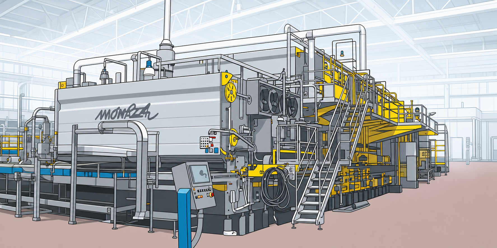

### Diagrama general de lavadora


### Diagramas por linea disponibles

| Linea | Imagen de referencia |
| --- | --- |
| L-04 | 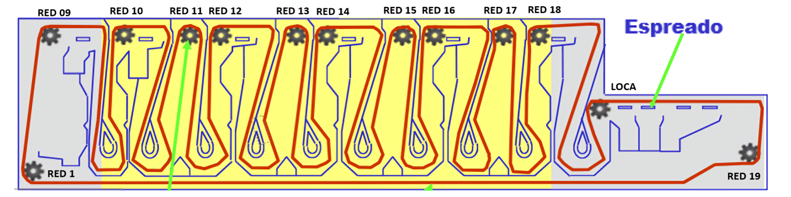 |
| L-05 | 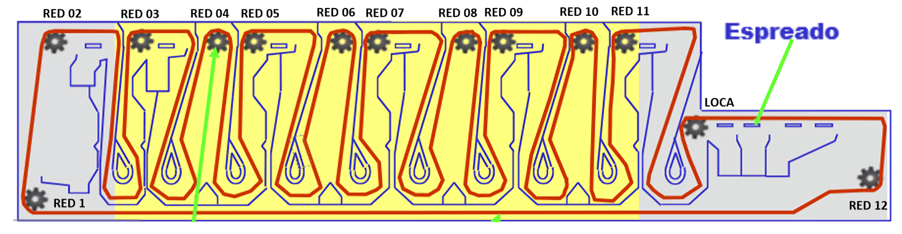 |
| L-06 | 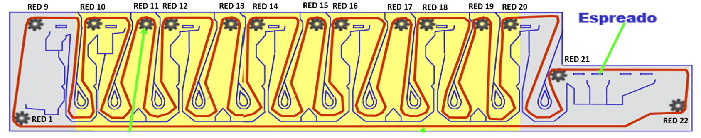 |
| L-07 | 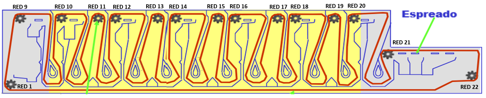 |
| L-09 |  |
| L-12 | 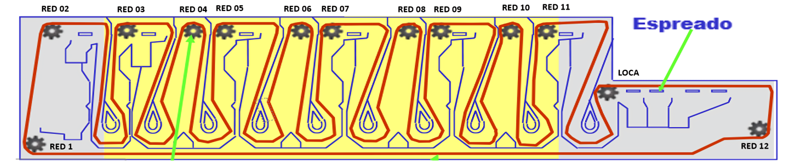 |
| L-13 | 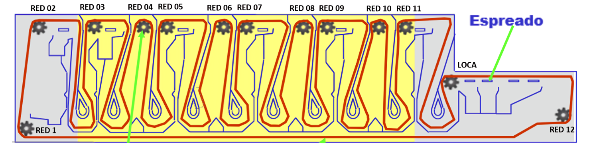 |

### Componentes de referencia

| Componente | Imagen |
| --- | --- |
| Catarinas | 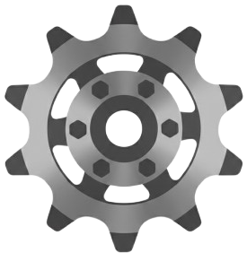 |
| RV200 | 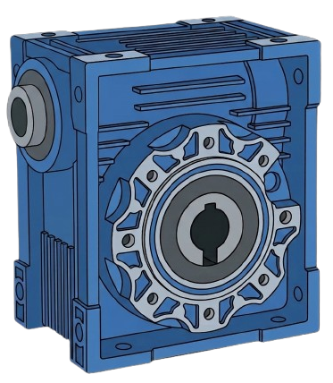 |
| RV200 Sin Fin | 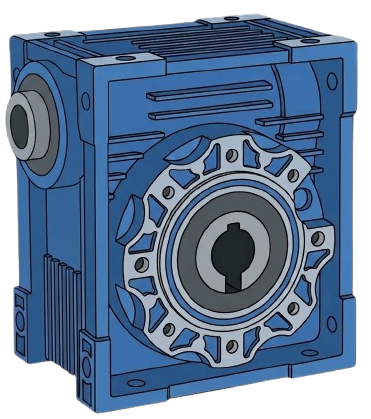 |
| Servo Grande | 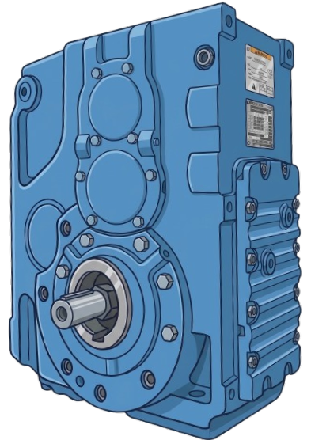 |
| Servo Chico | 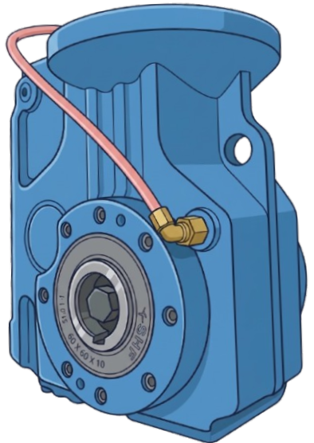 |
| Guia Superior Tanque | 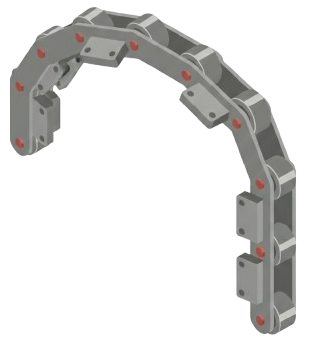 |
| Guia Interior Tanque | 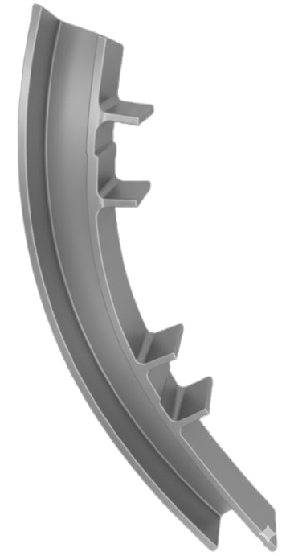 |
| Guia Inferior Tanque | 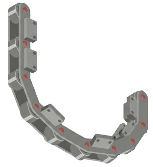 |
| Buje Espiga | 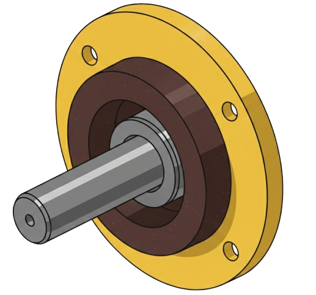 |

---

## 3. Entrada Al Modulo

### Ruta de navegacion

1. Ingresar al sistema con usuario y contrasena.
2. En el dashboard principal ubicar la tarjeta **Lavadoras**.
3. Presionar **Acceder al Modulo**.
4. Revisar la pantalla de resumen o menu de Lavadora.

### Que se ve en el dashboard principal

La tarjeta de Lavadoras puede mostrar:

- Total de equipos.
- Alertas criticas.
- Componentes severos o moderados.
- Componentes que requieren revision.
- Componentes en buen estado.
- Fecha de ultima actualizacion.

### Criterio rapido de atencion

Si hay **alertas criticas**, revisar primero:

1. **Analisis Lavadora**.
2. **Plan de Accion**.
3. **Costos**, si se requiere validar impacto economico.
4. **Historico de Revisados**, para saber si el componente esta vencido o pendiente de revision.

---

## 4. Mapa De Vistas De Lavadora

| Vista | Ruta aproximada | Uso principal |
| --- | --- | --- |
| Dashboard principal | `/dashboard` | Elegir el modulo Lavadora. |
| Dashboard global de lavadoras | `/dashboard/global/lavadoras` | Ver resumen global, estados, fallas, ranking, elongaciones, historico y costos. |
| Menu operativo Lavadora | `/lavadora/dashboard` | Entrar a Analisis, Elongacion, Historico, Planes, Tendencias y Costos. |
| Analisis Lavadora | `/analisis-lavadora` | Consultar matriz/listado de componentes y estados. |
| Seleccionar linea | `/analisis-lavadora/seleccionar-linea` | Elegir lavadora antes de capturar. |
| Crear analisis | `/analisis-lavadora/crear/{linea}` | Registrar un analisis completo por linea. |
| Crear rapido | `/analisis-lavadora/crear-rapido` | Registrar desde una celda o componente especifico. |
| Revision general | `/analisis-lavadora/revision-general/{linea}` | Registrar revision general de varios componentes. |
| Detalle de analisis | `/analisis-lavadora/{id}` | Ver informacion, actividad, evidencia y costos. |
| Editar analisis | `/analisis-lavadora/{id}/editar` | Modificar datos permitidos o evidencias. |
| Historial de analisis | `/analisis-lavadora/historial` | Consultar registros historicos del componente. |
| Costos por analisis | `/analisis-lavadora/{id}/costos` | Administrar costos automaticos y manuales de un hallazgo. |
| Costos de Lavadoras | `/lavadora/costos` | Ver dashboard financiero de gastos y presupuestos. |
| Elongaciones | `/elongaciones` | Consultar mediciones de cadena. |
| Registrar elongacion | `/elongaciones/create` | Capturar mediciones de lado bombas y vapor. |
| Detalle de elongacion | `/elongaciones/{id}` | Ver una medicion guardada. |
| Comparacion de ciclos | `/elongaciones/comparacion-ciclos` | Comparar ciclos de cadena por linea. |
| Historial de ciclo | `/elongaciones/ciclos/{ciclo}` | Ver mediciones dentro de un ciclo. |
| Historico de Revisados | `/historico-revisados?tipo=lavadora` | Revisar avance y vencimientos de revision. |
| Plan de Accion | `/plan-accion?tipo=lavadora` | Dar seguimiento a actividades de lavadora. |
| Crear plan | `/plan-accion/create?tipo=lavadora` | Capturar una nueva actividad. |
| Editar plan | `/plan-accion/{id}/edit?tipo=lavadora` | Modificar fechas, actividad o cierre. |
| Revision IA | `/plan-accion/ai/lavadora` | Revisar sugerencias de planes generadas por IA. |
| Base de conocimiento | `/lavadora/documentos-conocimiento` | Administrar documentos tecnicos para IA de lavadora. |
| Tendencias 52-12-4 / 30-14-7 | `/analisis-tendencia-mensual` | Analizar tendencia de danos por periodos. |
| Diagramas Lavadoras | `/lavadoras/diagramas` | Ver diagramas de cadenas y componentes por grupos de lineas. |

---

## 5. Menu Operativo Lavadora

### Ruta

`Dashboard principal > Lavadoras > Menu Lavadora`

### Opciones disponibles

Segun permisos, se muestran tarjetas como:

- **Analisis Lavadora**: captura y consulta de componentes.
- **Elongacion Cadena**: mediciones y ciclos de cadena.
- **Historico de Revisados**: control de revision por componente.
- **Plan de Accion**: seguimiento preventivo/correctivo.
- **Analisis 52-12-4 / 30-14-7**: tendencias de danos.
- **Costos**: gastos, presupuestos y estadisticas financieras.

### Como usarlo

1. Identificar la tarjeta que corresponde al trabajo.
2. Presionar **Acceder**.
3. Si la tarjeta no aparece, validar permisos con el administrador.

---

## 6. Analisis Lavadora

### Ruta

`Lavadora > Analisis Lavadora`

### Para que sirve

Permite consultar el estado actual de componentes por lavadora, registrar nuevos analisis, abrir detalles, ver evidencia fotografica, revisar historial y actualizar cierres/correcciones cuando el usuario tiene permiso.

### Elementos principales

- Filtro por lavadora/linea.
- Filtro por componente.
- Filtro por reductor o servo-reductor cuando aplica.
- Filtro por mes/ano.
- Filtro por estado.
- Tarjetas de resumen por estado.
- Matriz o listado de componentes.
- Accesos a detalle, historial, edicion, costos y evidencia.

### Estados que se usan

| Estado | Uso recomendado |
| --- | --- |
| Buen estado | El componente esta correcto. |
| Requiere revision | Hay condicion que debe revisarse, sin confirmar cambio inmediato. |
| Desgaste moderado | Existe deterioro con seguimiento. |
| Desgaste severo | Deterioro avanzado que requiere prioridad. |
| Danado - Requiere cambio | Condicion critica; debe generar accion. |
| Cambiado | El componente ya fue cambiado. |

### Consultar un analisis

1. Entrar a **Analisis Lavadora**.
2. Seleccionar la linea o dejar **Todas** si se requiere vista general.
3. Aplicar filtros de componente, mes/ano o estado.
4. Ubicar la celda o registro.
5. Abrir el detalle para ver informacion completa.

### Abrir evidencias

1. En la matriz o detalle, seleccionar la imagen o boton de evidencia.
2. Revisar fotografias cargadas.
3. Usar las flechas si hay varias imagenes.
4. Descargar o abrir en nueva pestana si la vista lo permite.

---

## 7. Crear Analisis De Lavadora

### Ruta

`Lavadora > Analisis Lavadora > Crear Analisis`

Tambien puede entrar por:

`Analisis Lavadora > Seleccionar Linea > elegir lavadora`

### Procedimiento

1. Presionar **Crear Analisis**.
2. Seleccionar la lavadora/linea.
3. Confirmar el componente.
4. Seleccionar reductor, servo-reductor o ubicacion equivalente si aplica.
5. Capturar **Fecha de Analisis**.
6. Capturar **Numero de Orden** si aplica.
7. Seleccionar **Estado**.
8. Escribir **Actividad / Observaciones**.
9. Adjuntar evidencia fotografica si corresponde.
10. Revisar la vista previa de imagenes.
11. Presionar **Guardar Analisis**.

### Resultado esperado

El registro queda visible en **Analisis Lavadora**, se integra al historial y puede alimentar planes de accion, costos, reportes y tendencias.

### Buenas practicas

- Usar una actividad clara: que se reviso, que se encontro y que se hizo.
- No duplicar fotos borrosas.
- Confirmar que la linea y componente sean correctos antes de guardar.
- Usar **Danado - Requiere cambio** solo cuando realmente requiere accion correctiva.

---

## 8. Crear Rapido Desde La Matriz

### Ruta

`Analisis Lavadora > celda/componente sin registro o accion rapida`

### Uso recomendado

Usar esta vista cuando ya se esta trabajando sobre una linea y componente especifico, y se quiere registrar sin pasar nuevamente por toda la seleccion.

### Procedimiento

1. Abrir **Analisis Lavadora**.
2. Ubicar la linea, componente y reductor/ubicacion.
3. Presionar la accion de crear rapido.
4. Capturar fecha, orden, estado, actividad y evidencias.
5. Guardar.

---

## 9. Revision General

### Ruta

`Analisis Lavadora > Revision General`

### Para que sirve

Permite registrar una revision general de varios componentes base de una lavadora sin capturar uno por uno desde la matriz.

### Procedimiento

1. Seleccionar la linea de lavadora.
2. Revisar la lista de componentes disponibles para revision general.
3. Capturar la fecha de analisis.
4. Capturar numero de orden si aplica.
5. Confirmar componentes revisados.
6. Guardar la revision.

### Resultado esperado

El sistema genera registros asociados a la linea y componentes revisados para mantener actualizado el historico.

---

## 10. Detalle, Edicion Y Eliminacion De Analisis

### Ver detalle

Ruta:

`Analisis Lavadora > abrir registro`

En detalle se puede consultar:

- Linea.
- Componente.
- Reductor o servo-reductor.
- Fecha del analisis.
- Estado.
- Actividad.
- Historial de cambios de fecha.
- Evidencia fotografica.
- Acceso a costos.

### Editar analisis

1. Abrir el detalle.
2. Presionar **Editar**.
3. Modificar campos permitidos.
4. Agregar o eliminar evidencias si se cuenta con permiso.
5. Guardar cambios.

### Eliminar analisis

Solo debe usarse si el registro fue capturado por error. Requiere permiso especial.

---

## 11. Cierre O Correccion De Hallazgos

### Ruta

`Analisis Lavadora > abrir detalle de registro > seccion de correccion`

### Para que sirve

Permite documentar que un dano fue atendido.

### Campos que puede solicitar

- Estado de correccion.
- Fecha de correccion.
- Tipo de intervencion.
- Observaciones de reparacion.
- Componente instalado.
- Numero de parte.
- Fecha del cambio.
- Proveedor.
- Garantia.
- Costo de refacciones.
- Costo de mano de obra.
- Costo de servicios externos.
- Horas.
- Responsable.
- Evidencia de reparacion.

### Recomendacion

Cuando el componente quede solucionado, completar la correccion para que el dashboard y los seguimientos no mantengan el dano como pendiente.

---

## 12. Historial De Analisis

### Ruta

`Analisis Lavadora > Ver Historial`

### Para que sirve

Muestra registros anteriores de un componente, separados por lado o ubicacion cuando aplica.

### Como usarlo

1. Abrir un componente desde la matriz.
2. Presionar **Ver Historial**.
3. Revisar fechas, estados, actividad y evidencia.
4. Usar el historial para comparar si el dano es repetitivo.
5. Editar solo si el usuario tiene permiso.

---

## 13. Historico De Revisados

### Ruta

`Lavadora > Historico de Revisados`

### Para que sirve

Ayuda a confirmar que componentes ya fueron revisados y cuales estan vencidos, vigentes, sin revision o restablecidos.

### Procedimiento

1. Entrar a **Historico de Revisados**.
2. Seleccionar la linea.
3. Revisar las tarjetas de resumen.
4. Identificar componentes sin revision o vencidos.
5. Abrir el detalle del componente si se requiere.
6. Usar el enlace a **Analisis Lavadora** para capturar o consultar registros.

### Uso operativo

Antes de iniciar una ronda de inspeccion, revisar esta vista para priorizar componentes vencidos.

---

## 14. Elongacion De Cadena

### Ruta

`Lavadora > Elongacion Cadena`

### Vistas incluidas

- Historial de elongaciones.
- Crear registro.
- Detalle de medicion.
- Comparacion de ciclos.
- Historial del ciclo.
- Reporte de elongaciones.
- Alertas WhatsApp, si esta permitido.

### Historial de elongaciones

1. Entrar a **Elongacion Cadena**.
2. Filtrar por linea.
3. Filtrar por estado.
4. Filtrar por ciclo o proveedor.
5. Abrir el detalle con el icono de vista.

### Crear registro de elongacion

1. Presionar **Nuevo registro**.
2. Seleccionar linea.
3. Revisar el ciclo activo.
4. Si se instalo nueva cadena, activar **Instalar nueva cadena / reiniciar ciclo**.
5. Capturar proveedor, hodometro base, fecha de instalacion y observaciones si se crea ciclo nuevo.
6. Capturar mediciones de **Lado bombas**.
7. Capturar mediciones de **Lado vapor**.
8. Capturar hodometro actual si aplica.
9. Registrar juego de rodaja/holgura si corresponde.
10. Revisar las alertas calculadas.
11. Presionar **Guardar registro**.

### Interpretacion de alertas

| Alerta | Accion sugerida |
| --- | --- |
| Estado normal | Continuar monitoreo. |
| Considerar compra de cadena | Programar abastecimiento. |
| Cambio de cadena requerido | Crear o actualizar plan de accion. |

### Comparar ciclos

1. Entrar a **Comparar ciclos**.
2. Seleccionar linea.
3. Revisar ciclo activo, proveedor, fecha de instalacion, hodometro base y avance.
4. Abrir el historial del ciclo cuando se necesite ver mediciones.

---

## 15. Plan De Accion De Lavadora

### Ruta

`Lavadora > Plan de Accion`

### Para que sirve

Da seguimiento a actividades preventivas o correctivas generadas por analisis, elongaciones, tendencias o criterios de mantenimiento.

### Pantalla principal

La vista puede mostrar:

- Total de actividades.
- Actividades completadas.
- Actividades proximas a vencer.
- Actividades vencidas.
- Filtro por linea.
- Tarjetas por lavadora.
- Tabla de actividades y fechas PCM.
- Acciones para ver, editar, completar, notificar o eliminar.

### Crear actividad

1. Entrar a **Plan de Accion**.
2. Seleccionar una linea o dejar vista general.
3. Presionar **Nueva Actividad**.
4. Capturar linea.
5. Capturar actividad.
6. Capturar fechas PCM 1, PCM 2, PCM 3 y PCM 4 cuando aplique.
7. Guardar.

### Dar seguimiento

1. Abrir la actividad.
2. Revisar trazabilidad y fechas.
3. Editar si cambia la programacion.
4. Marcar como completada cuando se ejecute.
5. Capturar cierre:
   - Costo real total.
   - Horas reales.
   - Efectividad.
   - Resultado de ejecucion.

### Prioridad recomendada

| Condicion | Prioridad |
| --- | --- |
| Fecha vencida | Alta |
| Vence hoy o en pocos dias | Media/alta |
| Deriva de dano critico | Alta |
| Actividad preventiva programada | Normal |

---

## 16. Revision De Planes IA Para Lavadora

### Ruta

`Plan de Accion > Revision IA`

### Para que sirve

Muestra sugerencias de planes generadas a partir de hallazgos de lavadora. Solo usuarios autorizados pueden revisar, aprobar o rechazar.

### Flujo

1. Entrar a **Revision IA**.
2. Filtrar por linea y estado.
3. Abrir una sugerencia.
4. Revisar problema detectado, justificacion tecnica, riesgo y acciones recomendadas.
5. Ajustar titulo, prioridad, tipo de mantenimiento o fecha sugerida.
6. Elegir una accion:
   - **Aprobar y publicar**.
   - **Rechazar**.
   - **Solicitar informacion**.

---

## 17. Base De Conocimiento De Lavadoras

### Ruta

`Plan de Accion > Base de conocimiento`

### Para que sirve

Administra documentos tecnicos que la IA puede usar como contexto para sugerencias de mantenimiento.

### Consultar documentos

1. Entrar a **Base de conocimiento**.
2. Filtrar por linea.
3. Filtrar por componente.
4. Filtrar por estado de indexacion.
5. Revisar documentos registrados.
6. Reindexar si el documento lo requiere.

### Cargar documento

1. Presionar **Cargar documento**.
2. Capturar titulo.
3. Seleccionar tipo de documento.
4. Capturar version.
5. Seleccionar linea y componente si aplica.
6. Seleccionar estatus de vigencia.
7. Capturar fecha de vigencia.
8. Subir archivo o capturar texto/resumen tecnico.
9. Agregar notas internas si se requiere.
10. Presionar **Guardar e indexar**.

---

## 18. Costos De Lavadora

### Ruta

`Lavadora > Costos`

### Para que sirve

Permite visualizar gastos, presupuesto anual, costos por componente, costos por lavadora, evolucion del gasto, componentes mas reemplazados e historial reciente.

### Filtros

- Periodo.
- Lavadora.
- Ano de presupuesto.
- Fecha desde.
- Fecha hasta.

### Procedimiento

1. Entrar a **Costos**.
2. Seleccionar el periodo.
3. Seleccionar lavadora si se requiere detalle por linea.
4. Aplicar filtros.
5. Revisar:
   - Gasto del periodo.
   - Gasto del mes.
   - Gasto del ano.
   - Mayor costo acumulado.
   - Lavadora con mayor gasto.
   - Presupuesto anual.
   - Historial reciente.

### Costos por analisis

Ruta:

`Analisis Lavadora > Detalle > Administrar costos`

Uso:

1. Sincronizar costos automaticos cuando existan reglas.
2. Activar o desactivar reglas automaticas si aplica.
3. Agregar costos manuales con concepto, monto y referencia.
4. Eliminar costos manuales solo si fueron capturados por error.

---

## 19. Tendencias 52-12-4 Y 30-14-7

### Ruta

`Lavadora > Analisis 52-12-4 / 30-14-7`

### Para que sirve

Analiza danos registrados por ventanas de tiempo para identificar incremento, reduccion o estabilidad de fallas por lavadora.

### Vistas disponibles

- Resumen de tendencias.
- Vista 52-12-4.
- Vista 30-14-7.
- Crear registro manual de tendencia, si el rol lo permite.
- Detalle de analisis de tendencia.

### Como usarlo

1. Entrar a la vista de tendencias.
2. Seleccionar linea.
3. Revisar graficas y ventanas comparativas.
4. Identificar si la tendencia sube, baja o se mantiene.
5. Si hay incremento de danos, revisar **Analisis Lavadora** y **Plan de Accion**.

---

## 20. Diagramas De Lavadoras

### Ruta

`/lavadoras/diagramas`

### Grupos disponibles

| Vista | Lineas |
| --- | --- |
| `/lavadoras/diagramas/l04-l09` | L-04 y L-09 |
| `/lavadoras/diagramas/l05-l12-l13` | L-05, L-12 y L-13 |
| `/lavadoras/diagramas/l06-l07` | L-06 y L-07 |

### Uso

1. Entrar a **Diagramas Lavadoras**.
2. Seleccionar el grupo de lineas.
3. Revisar ubicacion de cadenas, catarinas y referencias.
4. Usar el diagrama como apoyo antes de registrar analisis o elongacion.

---

## 21. Reportes Relacionados Con Lavadora

### Reportes generales

En el modulo de reportes, seleccionar tipo de equipo **Lavadoras** y aplicar filtros por linea o rango de fecha.

### Reporte de elongaciones

Ruta:

`/elongaciones/reportes/elongaciones`

Procedimiento:

1. Abrir el reporte.
2. Seleccionar linea si aplica.
3. Revisar mediciones, promedios y estados.
4. Exportar o imprimir si la vista lo permite.

---

## 22. Flujo Recomendado Para Usar Lavadora

```text
Ingresar al sistema
        |
        v
Dashboard principal
        |
        v
Lavadoras
        |
        v
Revisar alertas y resumen
        |
        v
Analisis Lavadora / Historico de Revisados
        |
        v
Registrar analisis o revision general
        |
        v
Adjuntar evidencia fotografica
        |
        v
Guardar registro
        |
        v
Si hay dano: crear o actualizar Plan de Accion
        |
        v
Si hay cambio/reparacion: cerrar correccion y costos
        |
        v
Consultar tendencias, costos o reportes
```

---

## 23. Checklist Diario

Antes de capturar:

- [ ] Usar usuario propio.
- [ ] Confirmar que se esta en el modulo Lavadora.
- [ ] Revisar alertas criticas del dashboard.
- [ ] Confirmar linea/lavadora correcta.
- [ ] Tener orden, fecha y evidencia disponibles.

Durante la captura:

- [ ] Seleccionar componente correcto.
- [ ] Seleccionar reductor, servo-reductor o lado correcto.
- [ ] Elegir estado real.
- [ ] Escribir actividad clara.
- [ ] Adjuntar fotografias claras.
- [ ] Revisar antes de guardar.

Despues de guardar:

- [ ] Confirmar que el registro aparece en la matriz o historial.
- [ ] Crear plan de accion si el estado es critico.
- [ ] Registrar costos si hubo cambio o reparacion.
- [ ] Cerrar correccion cuando el trabajo quede terminado.

---

## 24. Errores Comunes Y Solucion

| Situacion | Posible causa | Accion recomendada |
| --- | --- | --- |
| No aparece Lavadoras | Falta permiso de modulo o dashboard | Solicitar revision al administrador. |
| No aparece una tarjeta del menu | Permiso especifico no asignado | Solicitar permiso de esa vista. |
| No se puede guardar analisis | Campo obligatorio incompleto | Revisar campos marcados y volver a guardar. |
| No carga evidencia | Archivo no valido o muy pesado | Usar imagen JPG, PNG o WEBP mas ligera. |
| No aparece una linea | Linea inactiva o fuera del catalogo de lavadoras | Validar configuracion de lineas. |
| No permite editar o eliminar | Permiso restringido | Solicitar autorizacion formal. |
| El dano sigue apareciendo como pendiente | Falta cierre/correccion | Completar la seccion de correccion. |
| Costos no se actualizan | No se sincronizaron reglas o falta permiso | Entrar a costos del analisis y sincronizar. |

---

## 25. Regla De Calidad Del Registro

Un registro de Lavadora se considera completo cuando tiene:

- Linea correcta.
- Componente correcto.
- Fecha de analisis.
- Estado correcto.
- Actividad u observacion clara.
- Numero de orden cuando aplica.
- Evidencia fotografica cuando aplica.
- Plan de accion para hallazgos criticos.
- Correccion/cierre si el dano ya fue atendido.
- Costos cuando hubo refacciones, mano de obra o servicio externo.

