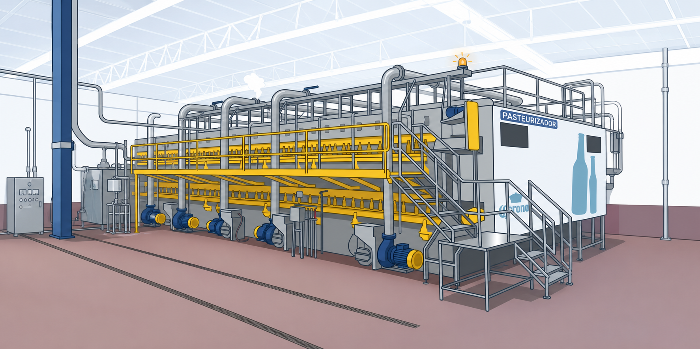
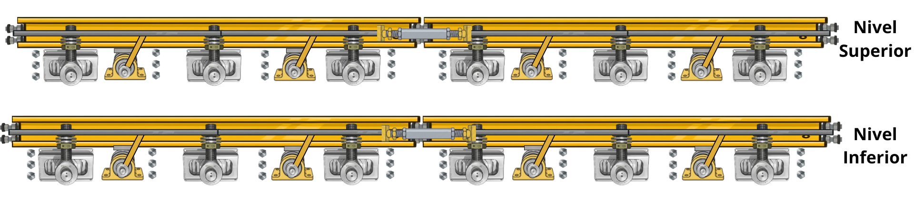
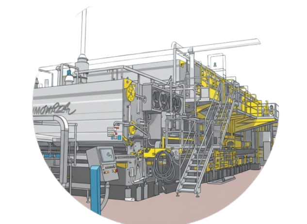
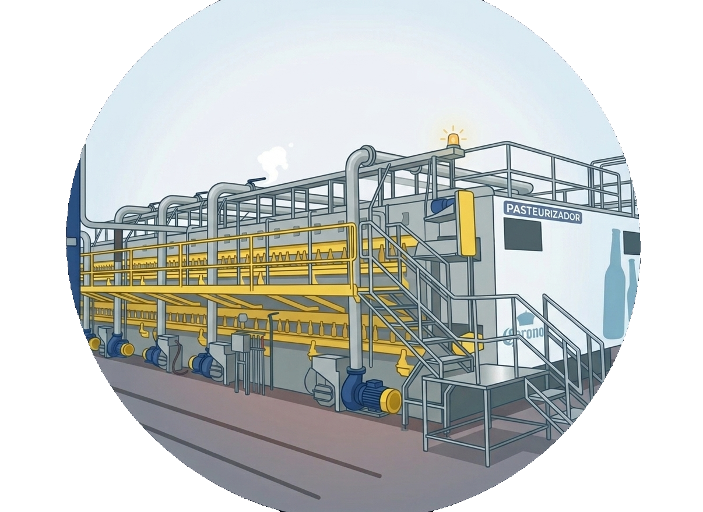
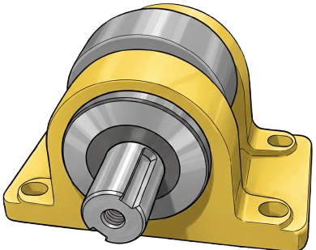
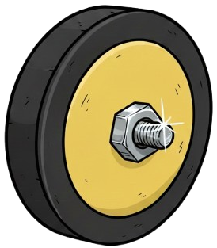

# SOP - Guia De Usuario Del Sistema Legado AB Fenix

**Codigo:** SOP-USR-ABF-001  
**Version:** 1.0  
**Fecha:** 21/09/2026  
**Area:** Departamento de Envasado CCZ  
**Sistema:** Legado AB Fenix  
**Dirigido a:** Administradores, supervisores, ingenieros, tecnicos, capturistas y usuarios operativos.

---

## 1. Objetivo

Establecer el procedimiento estandar para utilizar el sistema Legado AB Fenix, desde el ingreso a la plataforma hasta la consulta, captura, seguimiento y exportacion de informacion operativa de Lavadoras, Pasteurizadoras, Etiquetadoras, Elongaciones, Planes de Accion, Reportes, Notificaciones y Administracion de Usuarios.

---

## 2. Alcance

Esta guia aplica para usuarios que registran o consultan:

- Analisis de componentes de Lavadoras.
- Analisis mecanico y de Central Hidraulica de Pasteurizadoras.
- Analisis de Etiquetadoras.
- Mediciones de elongacion de cadena.
- Planes de accion preventivos o correctivos.
- Reportes PDF y vistas consolidadas.
- Notificaciones, perfil y permisos.
- Uso del asistente operativo ABFenix.ai, si el usuario tiene permiso.

La visibilidad de cada pantalla depende del rol y de los permisos asignados por el administrador.

---

## 3. Referencias Visuales Del Sistema

### Acceso e identidad visual


### Modulos principales

| Modulo | Imagen de referencia | Uso principal |
| --- | --- | --- |
| Lavadoras |  | Registro, consulta, costos, tendencias, elongaciones y planes de accion. |
| Pasteurizadoras |  | Analisis mecanico, Central Hidraulica, historicos, tendencias y planes de accion. |
| Etiquetadoras |  | Registro y seguimiento de componentes de etiquetadora. |
| Asistente IA |  | Consulta operativa y apoyo contextual dentro del sistema. |

### Diagramas tecnicos disponibles




---

## 4. Roles Y Responsabilidades

| Rol | Responsabilidad principal |
| --- | --- |
| Administrador | Gestionar usuarios, roles, permisos, catalogos, configuraciones y accesos. |
| Gerente / Supervisor / Programador de mantenimiento | Consultar dashboards, revisar reportes, dar seguimiento a planes y priorizar acciones. |
| Ingeniero de mantenimiento | Registrar analisis, revisar historicos, validar alertas y dar seguimiento tecnico. |
| Tecnico | Capturar analisis, evidencias fotograficas y actividades realizadas. |
| Capturista de Excentricos | Capturar informacion especifica de pasteurizadora cuando aplique. |

---

## 5. Requisitos Previos

Antes de operar el sistema, el usuario debe contar con:

- Usuario y contrasena activos.
- Rol asignado.
- Permisos para los modulos que necesita usar.
- Conexion a la red o servidor donde se publica el sistema.
- Camara o archivos de imagen cuando vaya a cargar evidencia fotografica.
- Informacion operativa necesaria: linea, componente, estado, orden, fecha, actividad y observaciones.

---

## 6. Ingreso Al Sistema

1. Abrir la URL del sistema.
2. En la pantalla de bienvenida, seleccionar **Acceder**.
3. Capturar correo y contrasena.
4. Presionar **Log In** o el boton equivalente de ingreso.
5. Verificar que se muestre el dashboard principal.

**Resultado esperado:** el usuario visualiza las tarjetas de los modulos autorizados.

**Nota:** Si aparece un mensaje de acceso denegado o faltan modulos, solicitar al administrador la revision de permisos.

---

## 7. Dashboard Principal

El dashboard principal muestra los modulos disponibles para el usuario:

- **Lavadoras**
- **Etiquetadoras**
- **Pasteurizadoras**

Cada tarjeta puede mostrar:

- Total de equipos.
- Alertas criticas.
- Componentes en riesgo.
- Componentes con buen estado.
- Fecha de ultima actualizacion.

### Procedimiento

1. Ingresar al sistema.
2. Identificar el modulo requerido.
3. Revisar si existen alertas criticas o equipos en riesgo.
4. Seleccionar **Acceder al Modulo**.

**Criterio de atencion:** si una tarjeta muestra alertas criticas, revisar primero los analisis asociados y generar o actualizar el plan de accion correspondiente.

---

## 8. Modulo Lavadoras



### 8.1 Acceso Al Modulo

Desde el dashboard principal, entrar a **Lavadoras**. Segun permisos, el usuario vera opciones como:

- Analisis Lavadora.
- Elongacion Cadena.
- Historico de Revisados.
- Plan de Accion.
- Analisis 52-12-4 / 30-14-7.
- Costos.

### 8.2 Registrar Analisis De Lavadora

1. Entrar a **Lavadoras > Analisis Lavadora**.
2. Seleccionar **Crear** o elegir una linea desde la pantalla de seleccion.
3. Confirmar la lavadora/linea.
4. Capturar los campos obligatorios:
   - **Componente**.
   - **Reductor / Servo-reductor**, segun linea.
   - **Lado del Analisis**, cuando el componente lo requiera.
   - **Fecha de Analisis**.
   - **Numero de Orden**, si aplica.
   - **Estado**.
   - **Actividad**.
5. Agregar evidencia fotografica:
   - **Subir desde galeria**, o
   - **Tomar foto ahora**.
6. Revisar la vista previa de imagenes.
7. Presionar **Guardar Analisis**.

**Resultado esperado:** el registro aparece en la matriz/listado de analisis de lavadora y queda disponible para consulta, evidencia, historial, costos y reportes.

### 8.3 Estados De Analisis

Usar el estado que describa la condicion real del componente:

| Estado | Uso recomendado |
| --- | --- |
| Buen estado | Componente revisado sin dano relevante. |
| Requiere revision | Existe condicion que requiere seguimiento. |
| Desgaste moderado | Deterioro presente, sin urgencia inmediata. |
| Desgaste severo | Deterioro avanzado, requiere prioridad. |
| Danado - Requiere cambio | Condicion critica; requiere cambio o accion inmediata. |
| Cambiado | Se realizo cambio fisico del componente. |

### 8.4 Consulta, Edicion Y Evidencias

1. Abrir **Analisis Lavadora**.
2. Filtrar por linea, componente, estado o fecha si la pantalla lo permite.
3. Seleccionar el registro o celda requerida.
4. Revisar detalle, fecha, orden, estado, actividad y fotografias.
5. Si el usuario tiene permiso, puede editar, eliminar evidencia o actualizar cierre/correccion.

### 8.5 Costos De Lavadora

El modulo **Costos** permite consultar gastos, presupuestos, tendencias, catalogos y reglas de costos asociados a lavadora.

Procedimiento general:

1. Entrar a **Lavadoras > Costos**.
2. Revisar resumen, presupuesto y gastos por linea/componente.
3. Si aplica, gestionar catalogos, reglas o costos manuales.
4. Verificar que cada costo tenga concepto, monto, referencia y relacion con el analisis cuando aplique.

---

## 9. Modulo Elongaciones De Cadena

### 9.1 Registrar Medicion

1. Entrar a **Lavadoras > Elongacion Cadena**.
2. Presionar **Crear** o **Registrar Elongacion**.
3. Seleccionar la linea.
4. Revisar el ciclo activo:
   - Codigo del ciclo.
   - Proveedor.
   - Hodometro base.
   - Fecha de instalacion.
5. Si se instala nueva cadena, activar **Instalar nueva cadena / reiniciar ciclo**.
6. Capturar proveedor, hodometro base, fecha y observaciones si se crea ciclo nuevo.
7. Capturar mediciones del lado bombas.
8. Capturar mediciones del lado vapor.
9. Revisar promedios, porcentaje de elongacion y alertas automaticas.
10. Guardar el registro.

### 9.2 Interpretacion De Alertas

| Resultado | Accion |
| --- | --- |
| Normal | Continuar seguimiento regular. |
| Comprar cadena | Programar compra o abastecimiento. |
| Cambio requerido | Generar prioridad en plan de accion y programar cambio. |

### 9.3 Comparar Ciclos

1. Entrar a **Comparar ciclos**.
2. Seleccionar linea o ciclo.
3. Revisar diferencias de avance, proveedor, horas y registros.
4. Usar la informacion para justificar decisiones de compra o cambio.

---

## 10. Modulo Pasteurizadoras



### 10.1 Acceso Al Modulo

Desde el dashboard principal, entrar a **Pasteurizadoras**. Segun permisos, el usuario puede ver:

- Analisis Pasteurizadora.
- Historico de Revisados.
- Analisis Pasteurizadora Central Hidraulica.
- Historico Central Hidraulica.
- Plan de Accion.
- Analisis 52-12-4 / 30-14-7.

### 10.2 Registrar Analisis Mecanico

1. Entrar a **Pasteurizadora > Analisis Pasteurizadora**.
2. Seleccionar linea.
3. Presionar **Agregar Analisis**.
4. Capturar:
   - **Modulo**.
   - **Componente**.
   - **Lado del analisis**: Vapor o Pasillo.
   - **Nivel del modulo**: Superior o Inferior.
   - **Piezas revisadas**, cuando el componente tenga varias piezas.
   - **Fecha del analisis**.
   - **Numero de orden**, si aplica.
   - **Estado del componente**.
   - **Actividad realizada y/o observaciones**.
5. Agregar evidencias fotograficas desde galeria o camara.
6. Presionar **Guardar Analisis**.

### 10.3 Central Hidraulica

1. Entrar a **Pasteurizadora > Central Hidraulica**.
2. Seleccionar linea.
3. Registrar componente, condicion, actividad, fecha y evidencia.
4. Guardar.
5. Revisar historial para confirmar que el registro quedo integrado.

### 10.4 Historico De Revisados

Usar el historico para confirmar avance de revision por linea, modulo, lado, nivel y componente. Esta vista ayuda a evitar duplicidad de captura y a validar ciclos de revision completos.

---

## 11. Modulo Etiquetadoras


### 11.1 Acceso Al Modulo

Desde el dashboard principal, entrar a **Etiquetadoras**. Segun permisos, se muestran:

- Analisis Etiquetadora.
- Historico de Revisados.
- Plan de Accion.

### 11.2 Registrar Analisis De Etiquetadora

1. Entrar a **Etiquetadora > Analisis Etiquetadora**.
2. Seleccionar linea.
3. Presionar **Crear**.
4. Capturar:
   - **Maquina**.
   - **Componente**.
   - **Piezas revisadas**, cuando aplique.
   - **Fecha de Analisis**.
   - **Numero de Orden**.
   - **Estado del Componente**.
   - **Actividad / Observaciones**.
5. Agregar evidencia fotografica desde galeria o camara.
6. Revisar la vista previa.
7. Presionar **Guardar Analisis**.

### 11.3 Consulta De Historial

1. Entrar a **Historico de Revisados** o al listado de analisis.
2. Filtrar por linea, maquina o componente.
3. Revisar estado, actividad, piezas revisadas y evidencia.
4. Editar solo si el usuario cuenta con permiso.

---

## 12. Plan De Accion

### 12.1 Proposito

El Plan de Accion sirve para dar seguimiento a actividades preventivas y correctivas relacionadas con los hallazgos de analisis, tendencias, elongaciones o inspecciones.

### 12.2 Crear Actividad

1. Entrar al modulo correspondiente:
   - **Lavadoras > Plan de Accion**.
   - **Pasteurizadoras > Plan de Accion**.
   - **Etiquetadoras > Plan de Accion**.
2. Presionar **Nueva Actividad** o **Crear**.
3. Seleccionar linea, si no viene precargada.
4. En Pasteurizadora, seleccionar la parte: Mecanica o Central Hidraulica.
5. Capturar **Actividad**.
6. Registrar una o varias fechas:
   - **Fecha PCM 1**.
   - **Fecha PCM 2**.
   - **Fecha PCM 3**.
   - **Fecha PCM 4**.
7. Presionar **Guardar Actividad**.

### 12.3 Dar Seguimiento

1. Abrir el listado de planes.
2. Revisar alertas de proximas fechas.
3. Editar la actividad cuando cambie la programacion.
4. Marcar como completada cuando se haya ejecutado.
5. Capturar retroalimentacion tecnica si la pantalla lo solicita:
   - Costo real.
   - Horas reales.
   - Resultado de ejecucion.
   - Efectividad.

### 12.4 Criterios De Prioridad

| Condicion | Prioridad sugerida |
| --- | --- |
| Fecha vencida o proxima a 1 dia | Alta |
| Fecha dentro de 3 dias | Media |
| Fecha dentro de 7 dias | Baja / seguimiento |
| Componente critico sin plan | Crear plan de inmediato |

---

## 13. Reportes

### 13.1 Consulta General

1. Entrar a **Reportes**.
2. Seleccionar **Tipo de Equipo**:
   - Lavadoras.
   - Pasteurizadoras.
   - Etiquetadoras.
3. Seleccionar maquina/linea o dejar **Todas las maquinas**.
4. Definir **Fecha Inicio** y **Fecha Fin**.
5. Presionar **Aplicar filtros**.

### 13.2 Exportar PDF

1. Aplicar filtros.
2. Presionar **Generar PDF** o **Exportar Reporte General PDF**.
3. Verificar que el PDF corresponda al tipo de equipo, linea y rango de fechas seleccionados.

### 13.3 Interpretacion Del Reporte

Los reportes pueden mostrar:

- Total de analisis.
- Planes pendientes.
- Elongacion.
- Tendencias 52-12-4.
- Tendencias 30-14-7.
- Historico de revisados.
- Estado general de linea.

---

## 14. Notificaciones

### 14.1 Bandeja De Notificaciones

1. Entrar a **Notifications** o al icono/listado de notificaciones.
2. Revisar avisos pendientes.
3. Abrir la notificacion para ir al registro relacionado.
4. Marcar como leida cuando corresponda.

### 14.2 Configuracion

1. Entrar a **Profile / Notifications** o **Notificaciones > Configuracion**.
2. Verificar datos de contacto.
3. Ajustar preferencias si el rol lo permite.
4. Guardar cambios.

---

## 15. Perfil De Usuario

1. Abrir el menu del usuario en la parte superior.
2. Seleccionar **Profile**.
3. Actualizar datos personales permitidos.
4. Cambiar contrasena si es necesario.
5. Guardar cambios.
6. Usar **Log Out** al terminar la sesion.

---

## 16. Administracion De Usuarios

Esta seccion aplica solo para usuarios con permiso de administracion.

### 16.1 Crear Usuario

1. Entrar a **Gestion de usuarios**.
2. Presionar **Nuevo usuario**.
3. Capturar datos de la cuenta.
4. Seleccionar rol.
5. Asignar permisos personalizados cuando aplique.
6. Guardar.

### 16.2 Editar Usuario

1. Buscar usuario por nombre, correo, cedula, puesto o telefono.
2. Filtrar por rol o estado si se requiere.
3. Abrir el usuario.
4. Actualizar datos, rol, estado o permisos.
5. Guardar cambios.

### 16.3 Buenas Practicas De Permisos

- Dar solo los permisos necesarios para la funcion del usuario.
- Revisar permisos de eliminacion con especial cuidado.
- Desactivar usuarios que ya no deben ingresar.
- Validar acceso por modulo despues de cambiar permisos.

---

## 17. Asistente Operativo ABFenix.ai


Si el usuario cuenta con permiso, vera un boton flotante para abrir el chat.

### Uso Recomendado

1. Presionar **Abrir chat**.
2. Escribir la pregunta en el campo **Escribe tu pregunta...**.
3. Presionar **Enviar** o usar Enter.
4. Revisar la respuesta y las fuentes/adjuntos si aparecen.
5. Usar **Limpiar historial** cuando se requiera borrar la conversacion guardada.

Ejemplos de preguntas utiles:

- "Que componentes criticos tiene la L-05?"
- "Resume los planes pendientes de lavadora."
- "Ayudame a interpretar este analisis."
- "Que debo revisar si una cadena supera el limite de cambio?"

---

## 18. Evidencias Fotograficas

### Reglas De Captura

- Tomar imagen clara, enfocada y con buena iluminacion.
- Capturar el componente completo y, si es posible, acercamiento del dano.
- Evitar imagenes borrosas o duplicadas.
- Usar **Subir desde galeria** si la foto ya existe.
- Usar **Tomar foto ahora** si se captura desde telefono o dispositivo compatible.
- Verificar que la vista previa muestre las imagenes correctas antes de guardar.

### Formatos Aceptados

El sistema acepta imagenes JPG, PNG, WEBP, GIF o BMP. En formularios de captura se valida el tamano maximo permitido por imagen.

---

## 19. Flujo Operativo Recomendado

```text
Ingreso al sistema
        |
        v
Dashboard principal
        |
        v
Seleccionar modulo
        |
        v
Consultar estado / historial
        |
        v
Registrar analisis o medicion
        |
        v
Adjuntar evidencia
        |
        v
Guardar registro
        |
        v
Generar plan de accion si hay riesgo
        |
        v
Dar seguimiento y cerrar actividad
        |
        v
Consultar o exportar reporte
```

---

## 20. Checklist De Uso Diario

Antes de iniciar:

- [ ] Ingresar con usuario propio.
- [ ] Confirmar que el modulo correcto esta visible.
- [ ] Revisar alertas criticas del dashboard.
- [ ] Tener linea, componente, orden y fecha disponibles.

Durante la captura:

- [ ] Seleccionar linea/equipo correcto.
- [ ] Seleccionar componente correcto.
- [ ] Capturar estado real.
- [ ] Escribir actividad clara y especifica.
- [ ] Adjuntar evidencia fotografica cuando aplique.
- [ ] Revisar vista previa antes de guardar.

Despues de guardar:

- [ ] Confirmar que el registro aparece en historial/listado.
- [ ] Crear o actualizar plan de accion si el estado es critico.
- [ ] Revisar notificaciones o alertas relacionadas.
- [ ] Exportar reporte si se requiere respaldo.

---

## 21. Errores Comunes Y Solucion

| Situacion | Posible causa | Accion recomendada |
| --- | --- | --- |
| No aparece un modulo | Falta permiso o rol incorrecto | Solicitar revision al administrador. |
| No se puede guardar | Campo obligatorio incompleto | Revisar campos marcados en rojo. |
| No carga una imagen | Archivo no valido o muy pesado | Usar JPG/PNG/WEBP y reducir tamano. |
| No aparece una linea | Linea inactiva o fuera del modulo | Revisar configuracion de lineas. |
| No permite eliminar | Usuario sin permiso especial | Solicitar autorizacion formal. |
| Notificaciones no llegan | Contacto o servicio no configurado | Revisar perfil, telefono/correo y configuracion del sistema. |

---

## 22. Control De Calidad Del Registro

Un registro se considera completo cuando contiene:

- Modulo y linea correctos.
- Componente/equipo correcto.
- Fecha de analisis o medicion.
- Estado seleccionado.
- Actividad/observacion clara.
- Numero de orden cuando aplique.
- Evidencia fotografica cuando aplique.
- Plan de accion cuando exista condicion critica o de seguimiento.

---

## 23. Anexos Visuales

### Componentes de lavadora


### Componentes de pasteurizadora





### Presentaciones de etiquetadora


---

## 24. Recomendacion Para Capacitacion

Para entrenar a un usuario nuevo:

1. Explicar dashboard principal y permisos.
2. Hacer un registro de prueba en el ambiente correspondiente.
3. Adjuntar una imagen de evidencia.
4. Consultar el registro en historial.
5. Crear un plan de accion.
6. Marcar actividad completada.
7. Generar un reporte PDF.
8. Cerrar sesion.

El instructor debe validar que el usuario pueda repetir el flujo sin asistencia antes de habilitar captura productiva.

